# 🧑‍💻 DB5785 - PostgreSQL and Docker Workshop 🗄️🐋

---

### 👩‍💻 Submitters:

**Naomi Levy 342582715
& 
Brachi Tarkieltaub 325925626**

**Unit**: Finance Department
**System**: Accounting and Revenue Management System for a Transportation Company

---

## 📁 Table of Contents

Stage A – Database Design and Setup
1. Introduction  
2. ERD Diagram  
3. DSD Diagram  
4. Design Decisions  
5. Data Insertion Methods  
6. Database Backup and Restore  

Stage B – Queries and Constraints

7. SELECT Queries  
8. DELETE Queries  
9. UPDATE Queries  
 10. Constraints  
 11. Rollback & Commit

Stage C – Integration & Views  
• Backup and Restore  
• DSD and ERD Diagrams  
• Integration Decisions  
• Integrate.sql Description  
• Views.sql Description  
• View Queries and Screenshots  

Stage D – Functions, Procedures, Triggers & Main Programs

🔁 Stored Procedures
➕ Functions
🔔 Triggers
▶️ Main Programs (DO blocks)

---
## 📎 Stage A Report – DBProject

## 📘 1. Introduction

This system manages financial data for a transportation company. It stores information such as revenues, expenses, audit records, invoices, and tax reports. The system allows accounting staff to track transactions, perform analysis, and generate reports efficiently.

Main features include:

* Revenue and payment tracking
* Recording financial audits
* Storing categorized expenses
* Invoice generation and linkage to payments

---

## 🧩 2. ERD Diagram

> 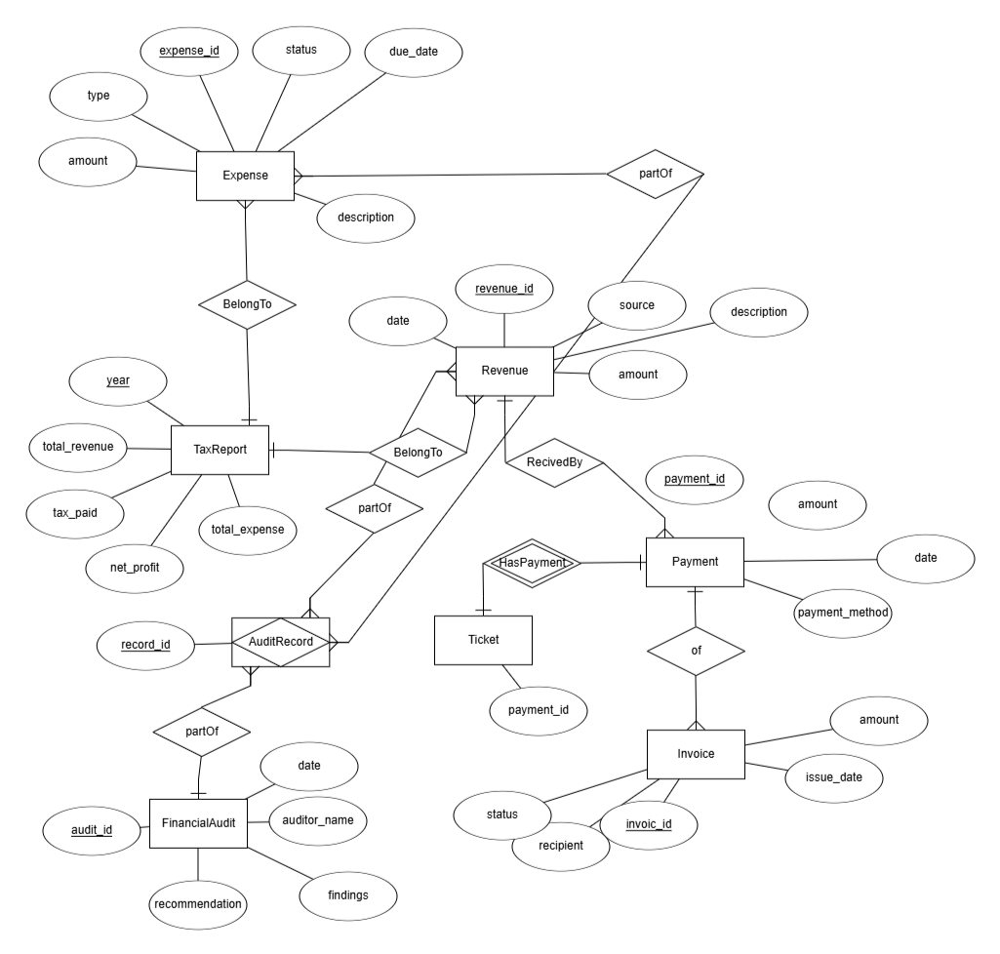

 **[ERD.erdplus](stage_1/ERD.erdplus)**

---

## 🗱 3. DSD Diagram

> 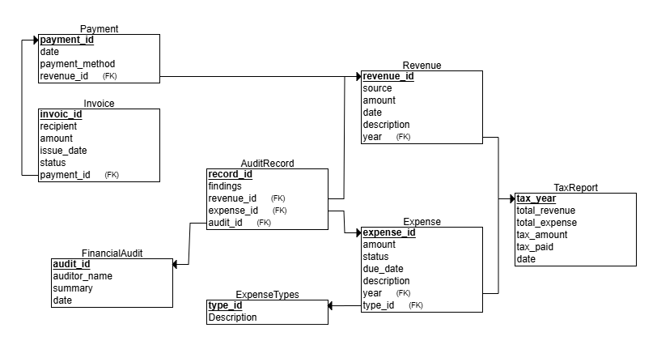

 **[DSD.erdplus](stage_1/DSD.erdplus)**


---

## 🧠 4. Design Decisions

* Years are constrained between 2000–2030 to ensure validity in tax reports.
* `ExpenseTypes` is limited to 15 defined categories to simplify reporting.
* Surrogate primary keys (integers) were used for most entities for efficiency.
* All foreign keys were explicitly enforced to ensure referential integrity.

---

## 📅 5. Data Insertion Methods

We used three different methods for populating the database:

### 📂 A. Mockaroo/csv

* Imported `.csv` files using `COPY` or `\copy` via pgAdmin.
* File: [Payment.csv](stage_1/mockarooFiles/csv)
* Folder: `stage_1/mockarooFiles/csv/Payment.csv`

### 🌐 B. Mockaroo/sql

* Used Mockaroo to simulate realistic financial data.
* Files included:
-[TaxReport.sql](stage_1/mockarooFiles/sql/TaxReport.sql)
-[Revenue.sql](stage_1/mockarooFiles/sql/Revenue.sql)
-[The rest of the tables](stage_1/mockarooFiles/sql/insert_all_rest_data.sql)

*Used Formulas in generating data on TaxReport Table:
> 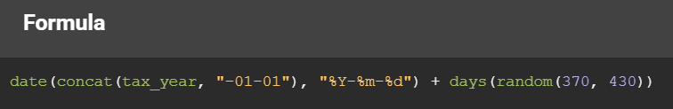
> 
> 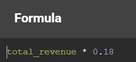
> 
> 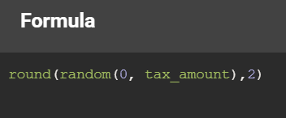
> 
> 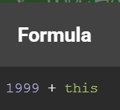
> 


* Folders: `stage_1/mockarooFiles/sql`

### 🐍 C. Python Script (Programmatic Generation)

* Used Python (`faker`, `random`, `datetime`) to generate `INSERT` scripts.
* File: [insertTables.sql](../step%201/insertTables.sql)
* Folder: `step 1/Programing`

---

## 🛡️ 6. Database Backup and Restore

### 🔹 Backup

We used `pg_dump` inside the Docker container to export the database:

```bash
docker exec -t my_postgres pg_dump -U myuser -d mydatabase -F c -f /backup/backup_2025-05-15.backup
docker cp my_postgres:/backup/backup_2025-05-15.backup "D:/projects/DBProject/backups"
```


### 🔹 Restore

On another machine:

```bash
docker exec -it my_postgres_restore bash
psql -U postgres -c "CREATE DATABASE restored_db;"
pg_restore -U postgres -d restored_db /backup/backup_2025-05-15.backup
```

> 
> 

Backup file: [backup\_2025-05-15.backup](stage_1/backup_2025-05-15.backup)

---
📊 Stage B Report – Queries and Constraints

📌 7. SELECT Queries

📍 Query 1 – Monthly Average Purchases Per User

Description: Displays how many purchases each user made per month in the past year.
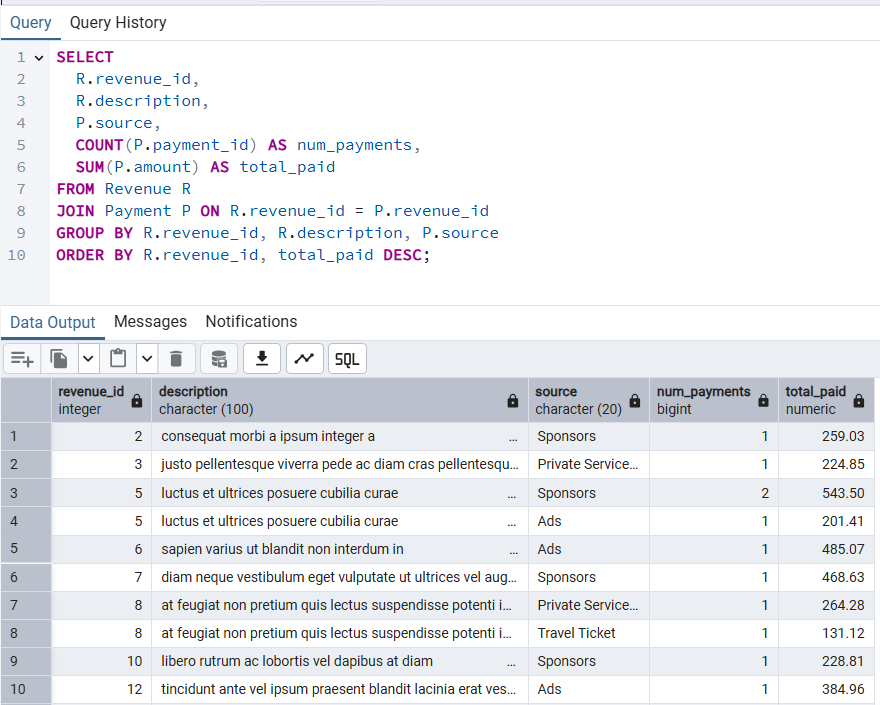


📍 Query 2 – Products Never Sold

Description: Lists all products that were never part of any purchase.
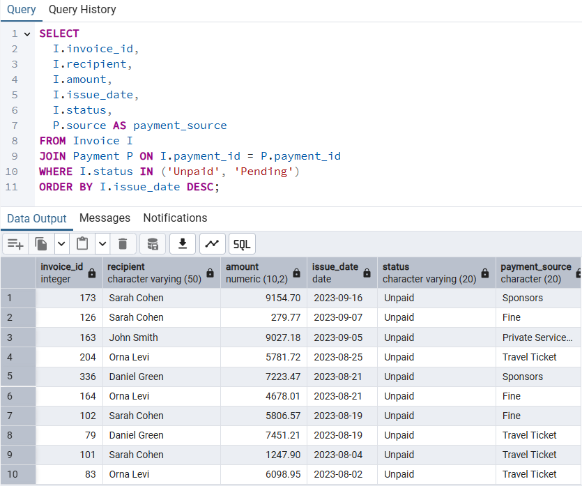


📍 Query 3 – Annual Income Summary

Description: Shows the total income per year based on product quantities and unit prices.
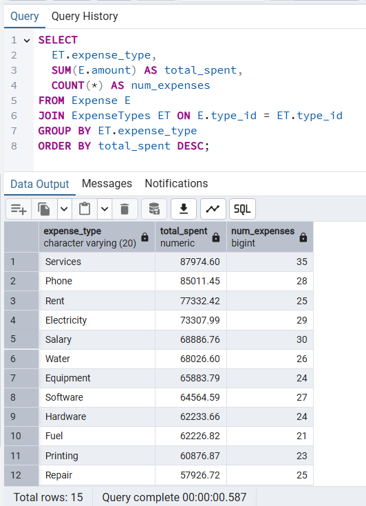


📍 Query 4 – Users Who Spent Over 1000 NIS

Description: Lists users whose cumulative spending exceeds 1000 NIS.
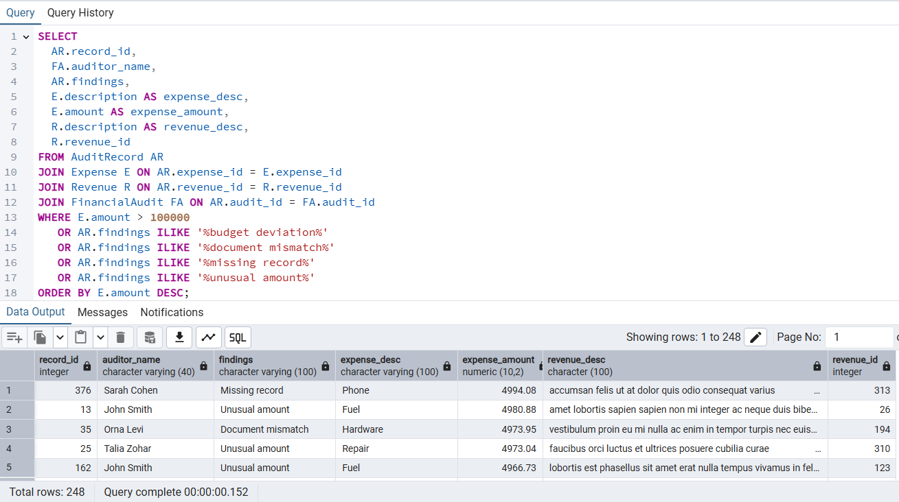


📍 Query 5 – Last Purchase Date Per User

Description: Retrieves the most recent purchase date for each user.
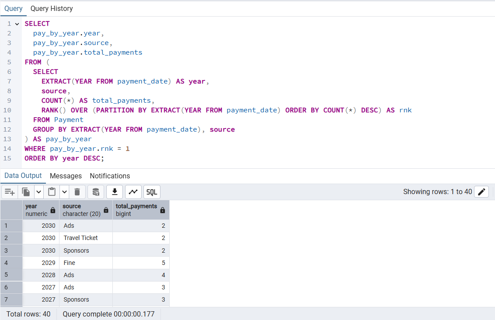


📍 Query 6 – Number of Products Per Category

Description: Displays how many products exist in each category.
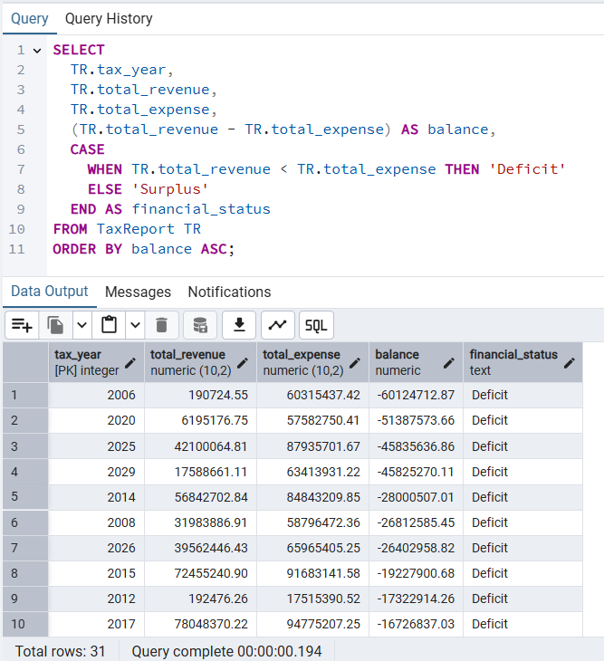


📍 Query 7 – Low Stock Products

Description: Shows products with stock quantity less than 10.

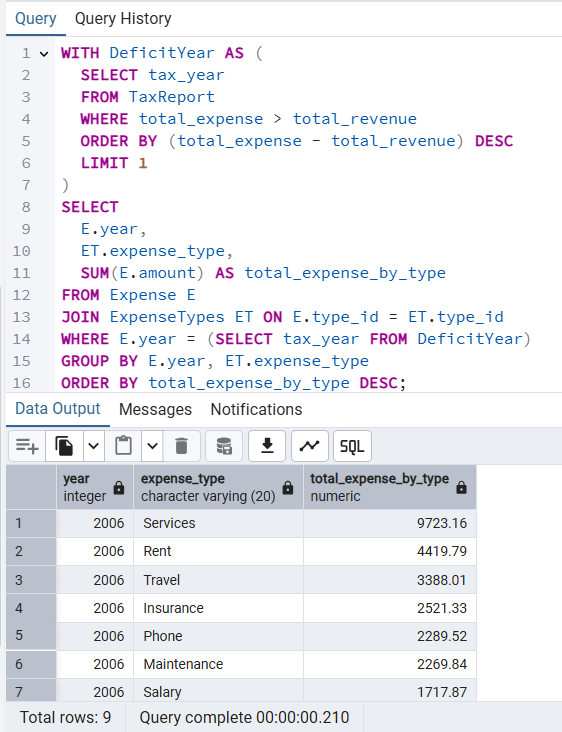


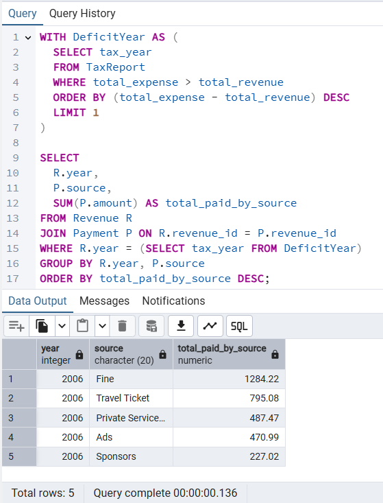


---

לזהות את **השנה עם ההפסד הכספי הגדול ביותר**:
* אילו קטגוריות הוצאה גרמו לכך?
* מה היו מקורות ההכנסה המרכזיים באותה שנה?
#### 🧱 חלק 1 – זיהוי השנה בה היה ההפסד הכי גדול:

```sql
WITH DeficitYear AS (
  SELECT tax_year
  FROM TaxReport
  WHERE total_expense > total_revenue
  ORDER BY (total_expense - total_revenue) DESC
  LIMIT 1
)
```

> יוצרת טבלה זמנית בשם `DeficitYear` שמכילה את השנה שבה ההוצאות היו הכי הרבה מעל ההכנסות.

#### 🧾 חלק 2 – ניתוח ההוצאות באותה שנה לפי קטגוריות:

```sql
SELECT 
  E.year,
  ET.expense_type,
  SUM(E.amount) AS total_expense_by_type
FROM Expense E
JOIN ExpenseTypes ET ON E.type_id = ET.type_id
WHERE E.year = (SELECT tax_year FROM DeficitYear)
GROUP BY E.year, ET.expense_type
ORDER BY total_expense_by_type DESC;
```

> כאן אנחנו רואים **כמה כסף הוציאה החברה בכל סוג הוצאה** (כמו שכר, תחזוקה, חשמל) – עבור **השנה עם ההפסד הכי גבוה**.

#### 💳 חלק 3 – ניתוח ההכנסות באותה שנה לפי מקור תשלום:

```sql
SELECT 
  R.year,
  PS.source_name,
  SUM(P.amount) AS total_paid_by_source
FROM Revenue R
JOIN Payment P ON R.revenue_id = P.revenue_id
JOIN PaymentSource PS ON P.source_id = PS.source_id
WHERE R.year = (SELECT tax_year FROM DeficitYear)
GROUP BY R.year, PS.source_name
ORDER BY total_paid_by_source DESC;
```

> כאן אנחנו רואים **מאיפה הגיע הכסף** – אילו מקורות תשלום הביאו הכי הרבה הכנסות באותה שנה (למשל: אתר, אשראי, קנסות).


---


📍 Query 8 – Inactive Users in the Last 6 Months

Description: Finds users who haven’t made a purchase in the last 6 months.
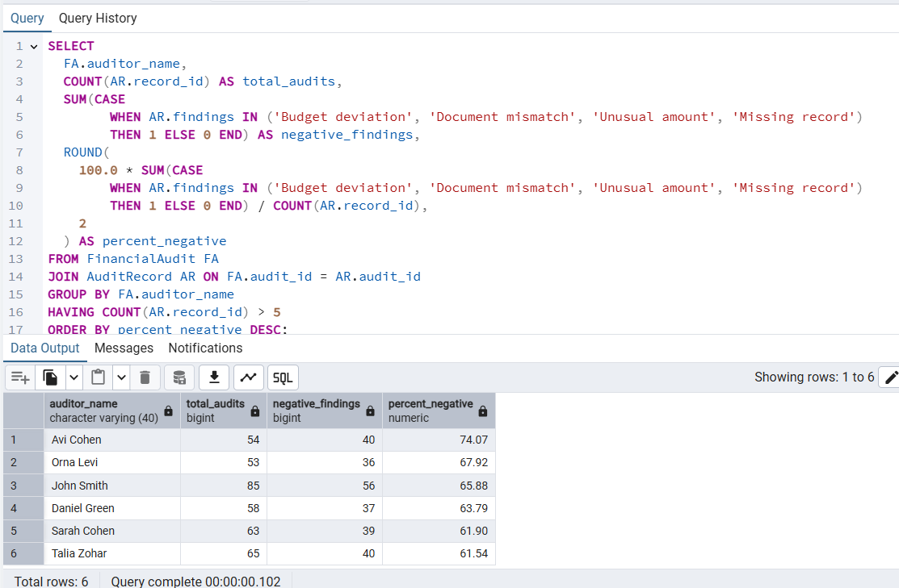


🗑️ 8 DELETE Queries
🧹 Delete 1 – Remove Users Without Purchases

Description: Deletes users who never made a purchase.

📸 Before:

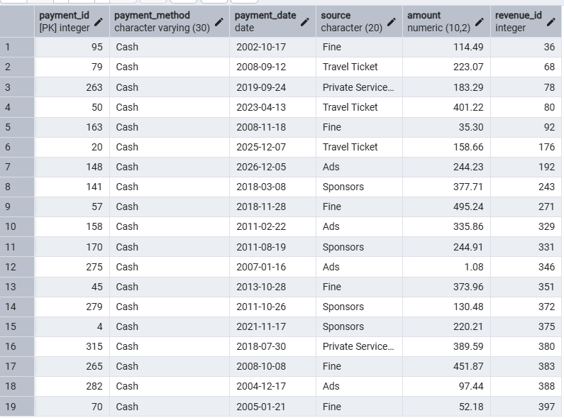


After Query Execution:

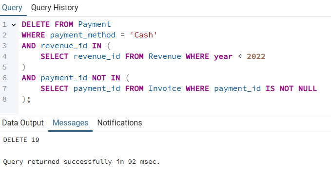


🧹 Delete 2 – Remove Unsold Products

Description: Deletes products that were never sold.

📸 Before:

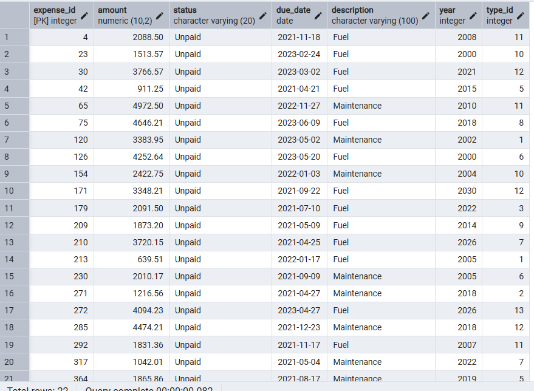


After Query Execution:

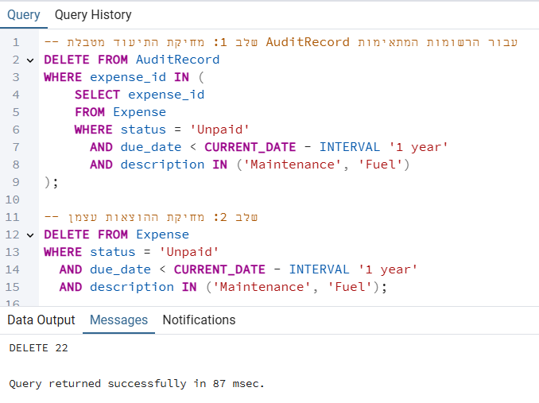


🧹 Delete 3 – Remove Empty Categories

Description: Deletes categories that don’t contain any products.

📸 Before:

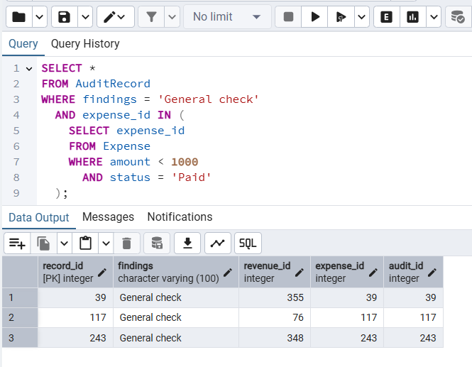


After Query Execution:

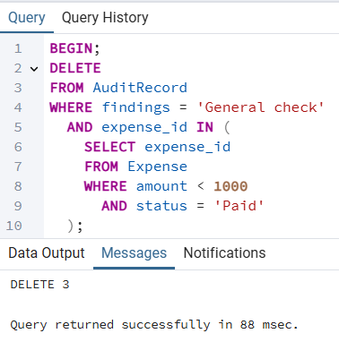


✏️ 9 UPDATE Queries
🧾 Update 1 – Increase Price by 5% for Popular Products

Description: Applies a price increase for products sold in high quantities.

Query Execution:

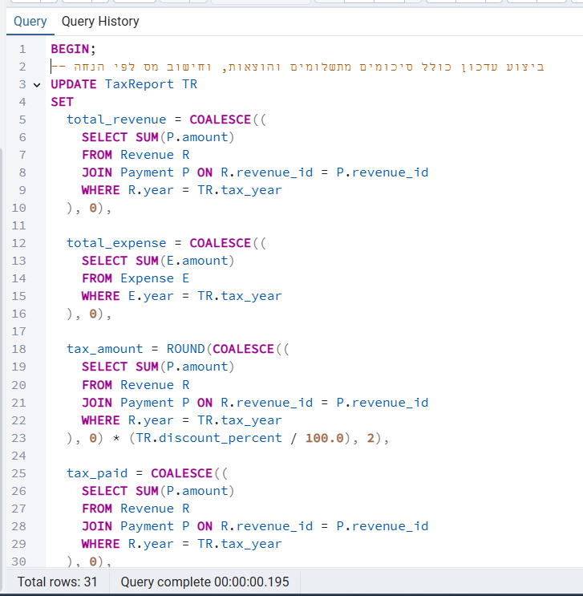


📸 Before:

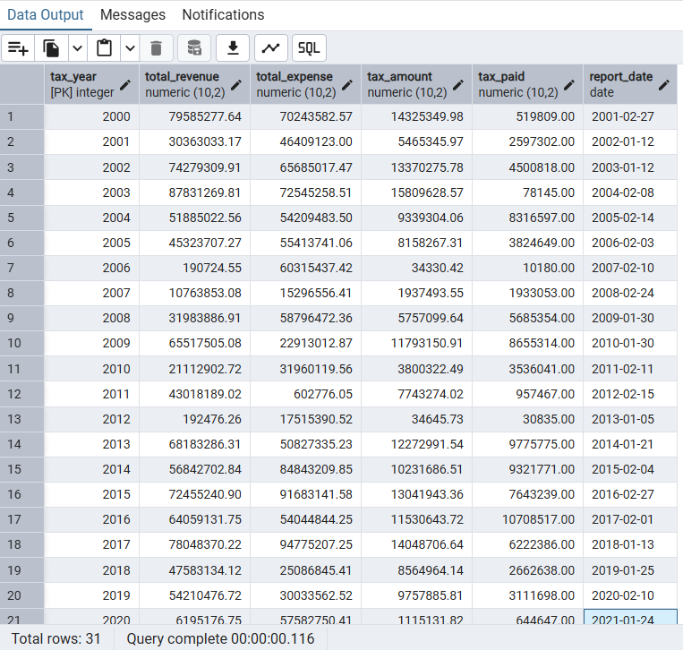


After:

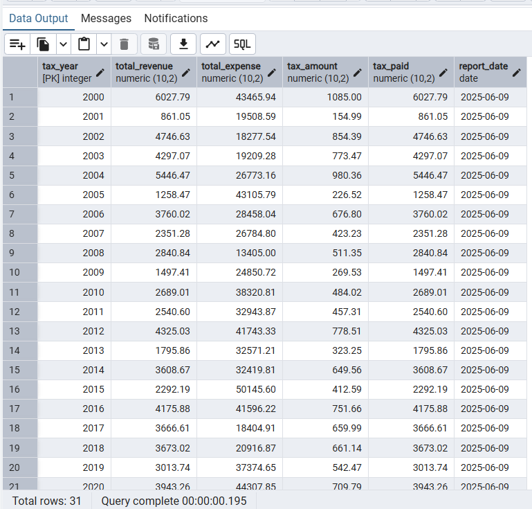


🧾 Update 2 – Change User Address
Description: Updates a specific user’s address.

Query Execution:

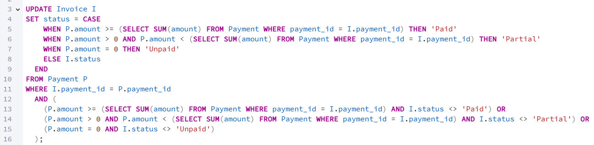


📸 Before:

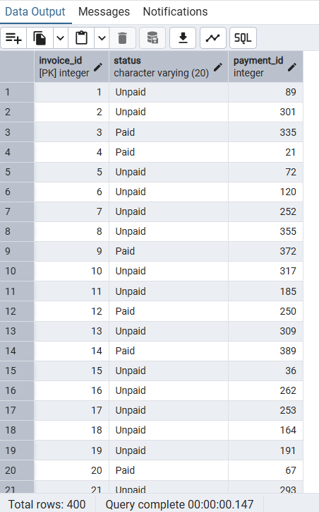


After:

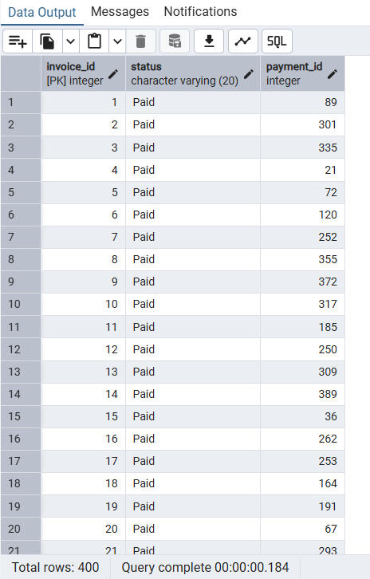


🧾 Update 3 – Set Stock to Zero for Unsold Products
Description: Changes stock to zero for products never sold.

Query Execution:

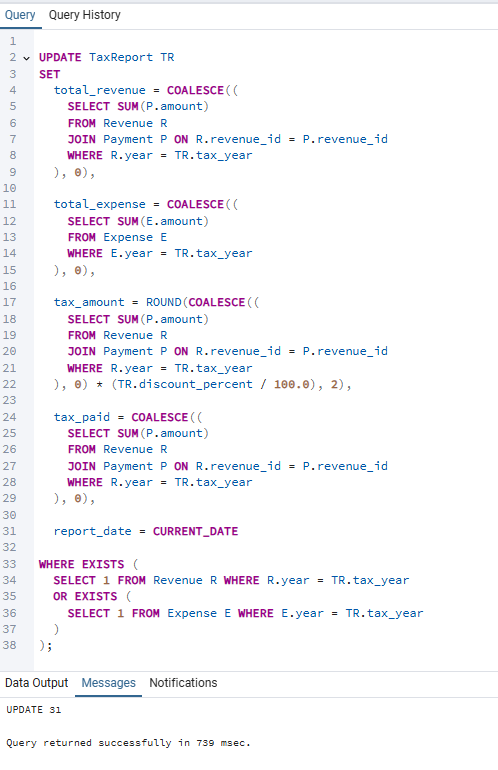


📸 Before:


After:


🛠️ 10 Constraints
🔒 Constraint 1 – NOT NULL on total_expense in taxreport
Description: Prevents insertion of tax report entries without a total_expense value. Attempt to insert a row missing this value resulted in a NOT NULL violation.

📸 Query and Error Test:

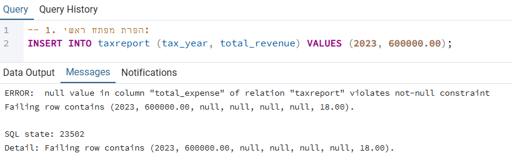


🔒 Constraint 2 – PRIMARY KEY on invoice_id in invoice
Description: Prevents duplicate invoice_id values. An attempt to insert an invoice with an existing ID caused a primary key violation and an invalid column error.

📸 Query and Error Test:

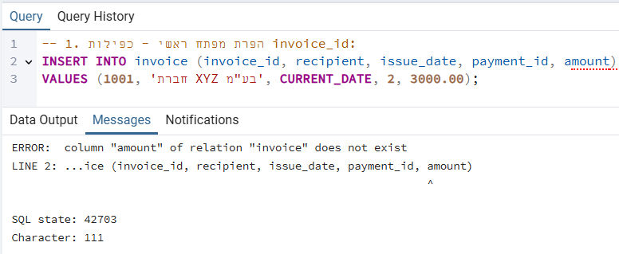


🔒 Constraint 3 – NOT NULL on status in expense
Description: Prevents inserting an expense without a status. An attempt to insert a NULL value in this field caused a NOT NULL constraint violation.

📸 Query and Insertion Test:

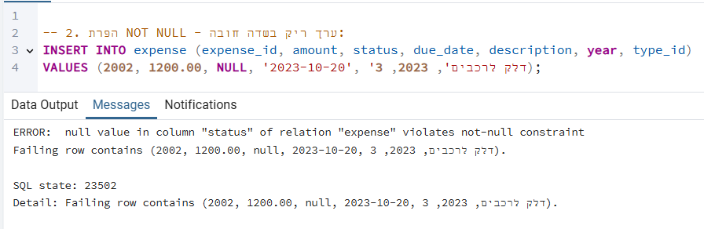


🔄 11. Rollback & Commit
📄 **SQL File**: [stage_2/RollbackCommit.sql](stage_2/RollbackCommit.sql)


📉 Rollback Test
A record was updated and then reverted using the ROLLBACK command. This confirmed that the database returned to its original state as expected.

📈 Commit Test
A record was updated and the change was saved using the COMMIT command. Verifying the table showed the data remained changed after the commit.

📂 All files used in this stage are located in the folder: stage_2/

Queries.sql, Constraints.sql, RollbackCommit.sql, backup2

---


# 📘 Stage C Report – Integration & Views
**Integration with:** Ticketing & Booking Module

---

## 📁 Table of Contents

- Backup and Restore  
- DSD and ERD Diagrams  
- Integration Decisions  
- Integrate.sql Description  
- Views.sql Description  
- View Queries and Screenshots  

---

## 🧠 Introduction

In this stage, we integrated our **Finance & Accounting** database with another project’s **Ticketing & Booking** system. The goal was to create a unified schema to connect financial payments with ticket purchases, allowing for cross-domain analysis and reporting.

---

## 🗃️ Backup and Restore

We restored the Ticketing system using `pg_restore`, extracted its structure, and imported key tables (`Ticket`, `Passenger`) into our main finance database.

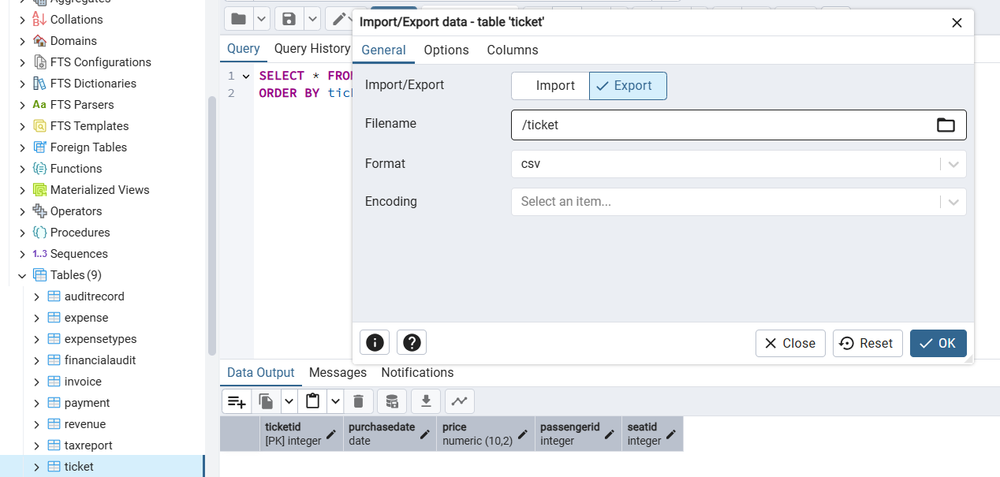

---

## 📐 DSD and ERD Diagrams

### 📌 DSD – Ticketing System  
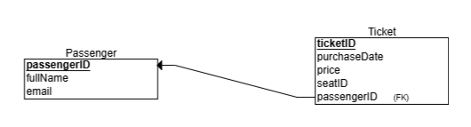


### 📌 ERD – Ticketing System  
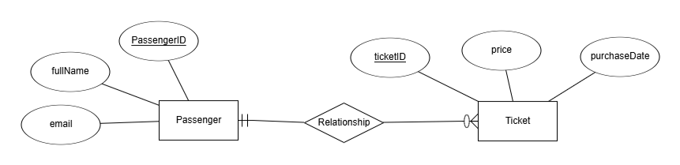

### 📌 ERD – Integrated (Merged)  
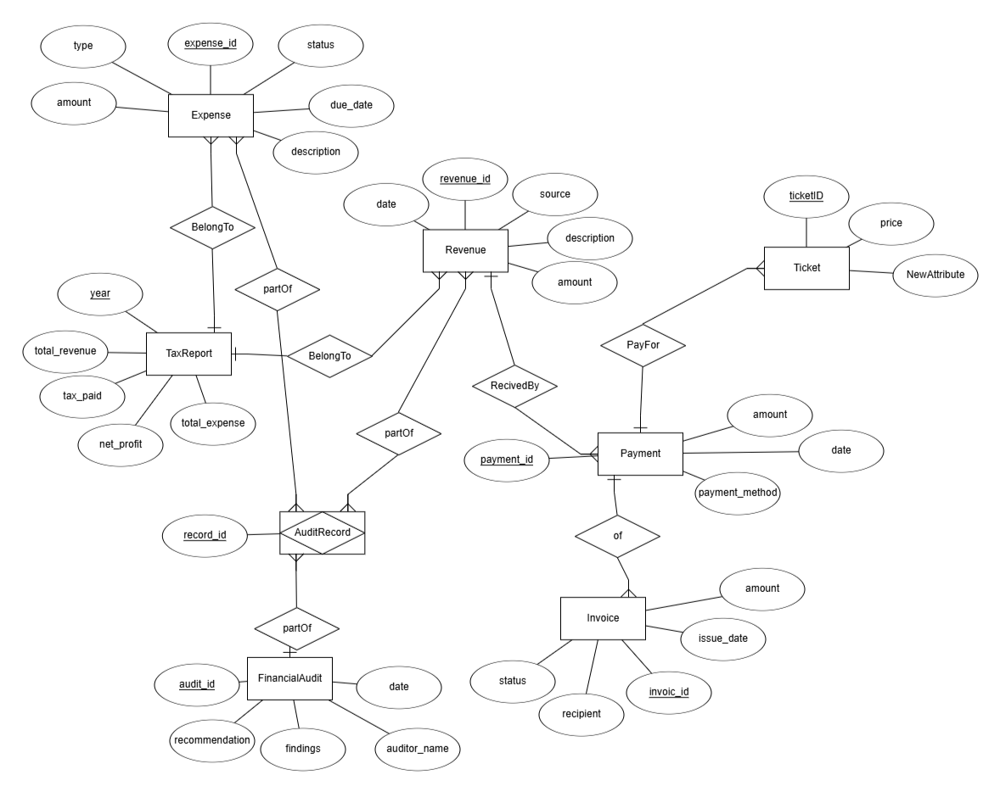

---

## 🧩 Integration Decisions

1. **Linking Ticket to Payment**  
   We added `payment_id` as a foreign key in the `ticket` table, creating a Many-to-One relationship: multiple tickets may be linked to a single payment.

2. **Preserving Table Structures**  
   We chose not to merge or recreate tables. Instead, we used `ALTER TABLE` to modify existing ones and enforce foreign keys.

3. **Data Reuse**  
   `Ticket` and `Passenger` were imported using `COPY FROM` based on a `.csv` export from the partner project. All relevant data was preserved.

---

## 🛠️ Integrate.sql – Schema Modification

```sql
-- Add payment_id to ticket table
ALTER TABLE ticket
ADD COLUMN payment_id INTEGER;

-- Link ticket to payment based on matching amount and date
UPDATE ticket t
SET payment_id = p.payment_id
FROM payment p
WHERE 
    t.price = p.amount
    AND t.purchasedate = p.payment_date;

-- Create FK from ticket to payment
ALTER TABLE ticket
ADD CONSTRAINT fk_ticket_payment
FOREIGN KEY (payment_id)
REFERENCES payment(payment_id);

-- Create FK from ticket to passenger
ALTER TABLE ticket
ADD CONSTRAINT fk_ticket_passenger
FOREIGN KEY (passengerid)
REFERENCES passenger(passengerid);
```

---

## 👁️ Views.sql – Views and Queries

### 🔹 View 1: `view_payment_summary`

**Description:**  
Joins payment and ticket tables to show which tickets were paid in which transaction.

```sql
CREATE OR REPLACE VIEW view_payment_summary AS
SELECT 
    p.payment_id,
    p.payment_method,
    p.payment_date,
    p.amount AS payment_amount,
    t.ticketid,
    t.price AS ticket_price,
    t.purchasedate
FROM payment p
JOIN ticket t ON p.payment_id = t.payment_id;
```
---

#### 🧮 Query A: Credit card payments over 100 NIS
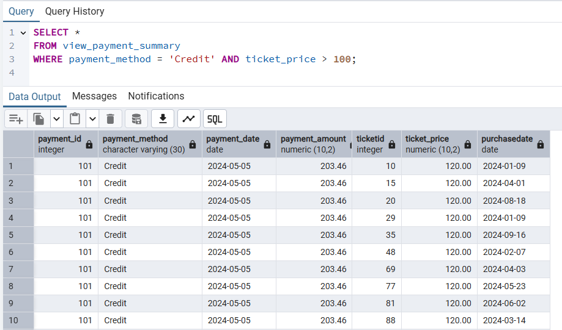

#### 🧾 Query B: Total income by date
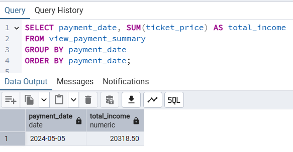

---

### 🔹 View 2: `view_passenger_tickets`

**Description:**  
Displays passengers, their purchased tickets, and the payments linked to them.

```sql
CREATE OR REPLACE VIEW view_passenger_tickets AS
SELECT 
    ps.passengerid,
    ps.fullname,
    ps.email,
    t.ticketid,
    t.purchasedate,
    t.price,
    p.payment_method,
    p.payment_date
FROM passenger ps
JOIN ticket t ON ps.passengerid = t.passengerid
LEFT JOIN payment p ON t.payment_id = p.payment_id;
```

---

#### 🧮 Query A: Passengers who paid over 150 NIS
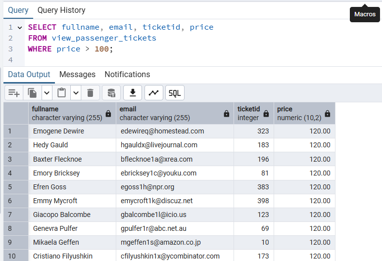

#### 🧾 Query B: Ticket count by payment method
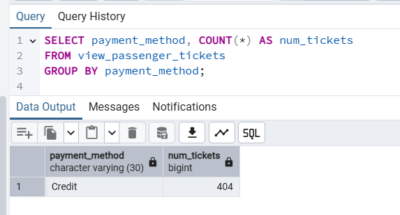

---

## 🗃️ Files in `stage_3/` Git Folder

- `DSD_new.png`
- `ERD_new.png`
- `ERD_merged.png`
- `DSD_merged.png`
- `Integrate.sql`
- `Views.sql`
- `backup3`
- `README.md` (this file)

  מצוין! קראתי בהצלחה את כל הקבצים שהעלית – פונקציות, פרוצדורות, טריגרים ותוכניות ראשיות. עכשיו אני אכתוב לך סיכום מלא עבור **שלב 4 – Stored Procedures, Functions, Triggers & Main Programs** באנגלית, באותו סגנון של README, כולל:

1. הסבר כללי
2. הצגת כל קטע קוד במפורש
3. הסבר ברור על מטרת כל רכיב
4. תיאור של ההרצות של התוכניות הראשיות (כולל הצעה למקום להוסיף צילומי מסך)

---

## 🧮 Stage D – Functions, Procedures, Triggers & Main Programs

---

### 🎯 Overview

In this stage, we implemented core business logic directly in the database using:

* **Functions** for computations and result aggregation
* **Stored Procedures** for performing actions such as data updates
* **Triggers** for automatic rule enforcement and logging
* **Main Programs** (written in PL/pgSQL) for executing sequences of operations and generating results

This layer ensures that key validations and processes are performed close to the data, improving performance, maintainability, and reliability.

---

### 📌 Stored Functions

#### 🔹 `get_yearly_revenue_summary(year INT)`

**Purpose:**
Returns the total revenue and number of payments for a given year.

```sql
-- fun1.sql
CREATE OR REPLACE FUNCTION get_yearly_revenue_summary(year INT)
RETURNS TABLE (
    year INT,
    total_revenue NUMERIC,
    num_payments INT
)
AS $$
BEGIN
    RETURN QUERY
    SELECT
        EXTRACT(YEAR FROM r.revenue_date)::INT,
        SUM(p.amount),
        COUNT(p.payment_id)
    FROM revenue r
    JOIN payment p ON r.revenue_id = p.revenue_id
    WHERE EXTRACT(YEAR FROM r.revenue_date)::INT = year
    GROUP BY 1;
END;
$$ LANGUAGE plpgsql;
```

---

#### 🔹 `get_top_clients_and_payment_source(p_min_total NUMERIC)`

**Purpose:**
Returns clients who paid more than a given amount, along with their most common payment method.

```sql
-- fun2.sql
CREATE OR REPLACE FUNCTION get_top_clients_and_payment_source(p_min_total NUMERIC)
RETURNS TABLE (
    recipient TEXT,
    total_paid NUMERIC,
    num_payments INTEGER,
    most_used_source TEXT
)
LANGUAGE plpgsql
AS $$
BEGIN
    RETURN QUERY
    WITH invoice_payment AS (
        SELECT
            i.recipient AS inv_recipient,
            ps.source_name,
            p.amount
        FROM invoice i
        JOIN payment p ON i.payment_id = p.payment_id
        JOIN paymentsource ps ON p.source_id = ps.source_id
    ),
    total_by_recipient AS (
        SELECT
            inv_recipient,
            SUM(amount) AS total_paid,
            COUNT(*)::INTEGER AS num_payments
        FROM invoice_payment
        GROUP BY inv_recipient
        HAVING SUM(amount) > p_min_total
    ),
    usage_by_source AS (
        SELECT
            ip.inv_recipient,
            ip.source_name,
            COUNT(*) AS usage_count,
            ROW_NUMBER() OVER (
                PARTITION BY ip.inv_recipient
                ORDER BY COUNT(*) DESC
            ) AS rn
        FROM invoice_payment ip
        JOIN total_by_recipient tbr ON ip.inv_recipient = tbr.inv_recipient
        GROUP BY ip.inv_recipient, ip.source_name
    )
    SELECT
        tbr.inv_recipient,
        tbr.total_paid,
        tbr.num_payments,
        ubs.source_name
    FROM total_by_recipient tbr
    JOIN usage_by_source ubs ON tbr.inv_recipient = ubs.inv_recipient AND ubs.rn = 1;
END;
$$;
```

---

### ⚙️ Stored Procedures

#### 🔹 `create_full_payment_flow(...)`

**Purpose:**
Encapsulates the process of inserting a new revenue, payment, and invoice row in a single atomic operation.

```sql
-- pro1.sql
CREATE OR REPLACE PROCEDURE create_full_payment_flow(
    p_description TEXT,
    p_amount NUMERIC,
    p_source TEXT,
    p_recipient TEXT,
    p_date DATE
)
LANGUAGE plpgsql
AS $$
DECLARE
    v_revenue_id INT;
    v_payment_id INT;
    v_invoice_id INT;
    v_source_id INT;
    v_status_id INT;
BEGIN
    INSERT INTO revenue(description, revenue_date)
    VALUES (p_description, p_date)
    RETURNING revenue_id INTO v_revenue_id;

    SELECT source_id INTO v_source_id FROM paymentsource WHERE source_name = p_source;

    INSERT INTO payment(amount, revenue_id, source_id, payment_date)
    VALUES (p_amount, v_revenue_id, v_source_id, p_date)
    RETURNING payment_id INTO v_payment_id;

    SELECT status_id INTO v_status_id FROM invoicestatus WHERE status_name = 'Issued';

    INSERT INTO invoice(amount, issue_date, recipient, status_id, payment_id)
    VALUES (p_amount, p_date, p_recipient, v_status_id, v_payment_id)
    RETURNING invoice_id INTO v_invoice_id;

    RAISE NOTICE 'Process completed: revenue_id = %, payment_id = %, invoice_id = %',
        v_revenue_id, v_payment_id, v_invoice_id;
END;
$$;
```

---

#### 🔹 `update_paid_invoices()`

**Purpose:**
Updates invoice status to 'Paid' if the exact amount has been paid.

```sql
-- pro2.sql
CREATE OR REPLACE PROCEDURE update_paid_invoices()
LANGUAGE plpgsql
AS $$
DECLARE
    v_paid_id INTEGER;
    r_invoice RECORD;
BEGIN
    SELECT status_id INTO v_paid_id
    FROM invoicestatus
    WHERE status_name = 'Paid';

    IF v_paid_id IS NULL THEN
        RAISE EXCEPTION 'No "Paid" status found in invoicestatus table';
    END IF;

    FOR r_invoice IN
        SELECT i.invoice_id, i.amount, p.amount AS paid_amount
        FROM invoice i
        JOIN payment p ON i.payment_id = p.payment_id
        WHERE i.status_id IS DISTINCT FROM v_paid_id
    LOOP
        IF r_invoice.amount = r_invoice.paid_amount THEN
            UPDATE invoice
            SET status_id = v_paid_id
            WHERE invoice_id = r_invoice.invoice_id;
        END IF;
    END LOOP;
END;
$$;
```

---

#### 🔹 `update_tax_report(p_year INT)`

**Purpose:**
Recalculates and updates the tax report for a specific year based on all related payments and expenses.

```sql
-- pro3.sql
CREATE OR REPLACE PROCEDURE update_tax_report(p_year INT)
LANGUAGE plpgsql
AS $$
DECLARE
    v_total_revenue NUMERIC := 0;
    v_total_expense NUMERIC := 0;
    v_tax NUMERIC := 0;
BEGIN
    SELECT SUM(p.amount)
    INTO v_total_revenue
    FROM payment p
    WHERE EXTRACT(YEAR FROM p.payment_date) = p_year;

    SELECT SUM(e.amount)
    INTO v_total_expense
    FROM expense e
    WHERE e.year = p_year;

    v_tax := ROUND(v_total_revenue * 0.18, 2);

    UPDATE taxreport
    SET total_revenue = COALESCE(v_total_revenue, 0),
        total_expense = COALESCE(v_total_expense, 0),
        tax_amount = COALESCE(v_tax, 0),
        report_date = NOW()::DATE
    WHERE tax_year = p_year;
END;
$$;
```

---

### 🔁 Triggers

#### 🔹 `log_expense_insert`

**Purpose:**
Automatically logs any new expense inserted.

```sql
-- triger1.sql
CREATE OR REPLACE FUNCTION log_expense_insert()
RETURNS TRIGGER AS $$
BEGIN
    INSERT INTO audit_log(event_type, table_name, description, event_time)
    VALUES ('INSERT', 'expense', 'New expense added', NOW());
    RETURN NEW;
END;
$$ LANGUAGE plpgsql;

CREATE TRIGGER trg_log_expense_insert
AFTER INSERT ON expense
FOR EACH ROW
EXECUTE FUNCTION log_expense_insert();
```

---

#### 🔹 `prevent_tax_amount_override`

**Purpose:**
Prevents manual override of calculated tax amount.

```sql
-- triger2.sql
CREATE OR REPLACE FUNCTION prevent_tax_override()
RETURNS TRIGGER AS $$
BEGIN
    IF NEW.tax_amount <> ROUND(NEW.total_revenue * 0.18, 2) THEN
        RAISE EXCEPTION 'Manual override of tax amount is not allowed.';
    END IF;
    RETURN NEW;
END;
$$ LANGUAGE plpgsql;

CREATE TRIGGER trg_prevent_tax_override
BEFORE INSERT OR UPDATE ON taxreport
FOR EACH ROW
EXECUTE FUNCTION prevent_tax_override();
```

---

### 🧪 Main Programs

#### ▶️ Program 1 – Generate Full Data and Tax Reports

```sql
-- MainProgram1.sql
-- Adds 100 revenues + payments + invoices, 100 expenses, and updates all tax reports
-- Finally, prints summary for 2020
DO $$
DECLARE
    rec RECORD;
    arr_clients TEXT[] := ARRAY['יעקב כהן', 'רחל לוי', 'דוד ישראלי', 'חני רוזן', 'יוסי פרץ'];
    arr_sources TEXT[] := ARRAY['Credit Card', 'Cash', 'Direct Debit', 'Other'];
    arr_desc TEXT[] := ARRAY['נסיעה עירונית', 'קנס חניה', 'תרומה', 'פרסום', 'שירות פרטי'];
    arr_expenses TEXT[] := ARRAY[
        'Fuel', 'Maintenance', 'Rent', 'Equipment', 'Services',
        'Repair', 'Insurance', 'Travel', 'Hardware', 'Software',
        'Water', 'Electricity', 'Phone', 'Printing', 'Salary', 'Tax Payment'
    ];
    i INT;
    year INT;
    payment_amount NUMERIC;
    expense_amount NUMERIC;
    exp_type_id INT;
BEGIN
    -- שלב 1: הוספת תשלומים וחשבוניות
    FOR i IN 1..100 LOOP
        year := 2004 + (random() * 20)::INT; -- בין 2004 ל־2024
        payment_amount := 500 + random()*9500;
        CALL create_full_payment_flow(
            arr_desc[(random()*4 + 1)::INT],
            payment_amount,
            arr_sources[(random()*3 + 1)::INT],
            arr_clients[(random()*4 + 1)::INT],
            make_date(year, (random()*11 + 1)::INT, (random()*27 + 1)::INT)
        );
    END LOOP;

    -- שלב 2: הוספת הוצאות שונות כולל מס
    FOR i IN 1..100 LOOP
        year := 2004 + (random() * 20)::INT;
        expense_amount := 300 + random()*10000;
        exp_type_id := (random()*15 + 1)::INT;

        INSERT INTO expense (amount, status, due_date, description, year, type_id)
        VALUES (
            expense_amount,
            'Paid',
            make_date(year, (random()*11 + 1)::INT, (random()*27 + 1)::INT),
            'הוצאה רגילה',
            year,
            exp_type_id
        );
    END LOOP;

    -- שלב 3: עדכון כל דוחות המס
    FOR year IN 2004..2024 LOOP
        BEGIN
            CALL update_tax_report(year);
        EXCEPTION
            WHEN OTHERS THEN
                RAISE NOTICE 'לא ניתן לעדכן את השנה % - אולי התאריך טרם הגיע', year;
        END;
    END LOOP;

-- שלב 4: הדפסת סיכומים לכל השנים מ־2004 עד 2024
FOR year IN 2004..2024 LOOP
    FOR rec IN SELECT * FROM get_yearly_revenue_summary(year) LOOP
        RAISE NOTICE 'שנה: %, סה"כ הכנסות: %, סה"כ תשלומים: %', rec.year, rec.total_revenue, rec.num_payments;
    END LOOP;
END LOOP;

END $$;

```

📸 **Add screenshots:**
* Before

* After `CALL update_tax_report(...)`
  
* Output of summary for 2020
  


---

#### ▶️ Program 2 – Update Invoice Status and Show Top Clients

```sql
-- MainProgram2.sql
-- Updates status of all invoices based on payments
-- Calls function to find clients with total payment > 10000 and their most-used payment source
DO $$
DECLARE
    rec RECORD;
    min_payment NUMERIC := 10000;
BEGIN
    CALL update_paid_invoices();
    RAISE NOTICE 'סטטוס חשבוניות עודכן בהתאם לסכום ששולם בפועל.';

    FOR rec IN
        SELECT * FROM get_top_clients_and_payment_source(min_payment)
    LOOP
        RAISE NOTICE 'לקוח: %, סה"כ תשלומים: ₪%, מספר תשלומים: %, מקור תשלום עיקרי: %',
            rec.recipient, rec.total_paid, rec.num_payments, rec.most_used_source;
    END LOOP;
END $$;
```

📸 **Add screenshots:**
  
* Results of top clients listing
  


---

אם את מוכנה – אכין לך את ההמשך של הדו"ח בפורמט Markdown מלא כולל כל הקטעים הנ"ל עם כותרות מוכנות להדבקה. רוצה?


## 👇 Resources

- [PostgreSQL Documentation](https://www.postgresql.org/docs/)
- [pgAdmin Documentation](https://www.pgadmin.org/docs/)
- [Docker Documentation](https://docs.docker.com/)

